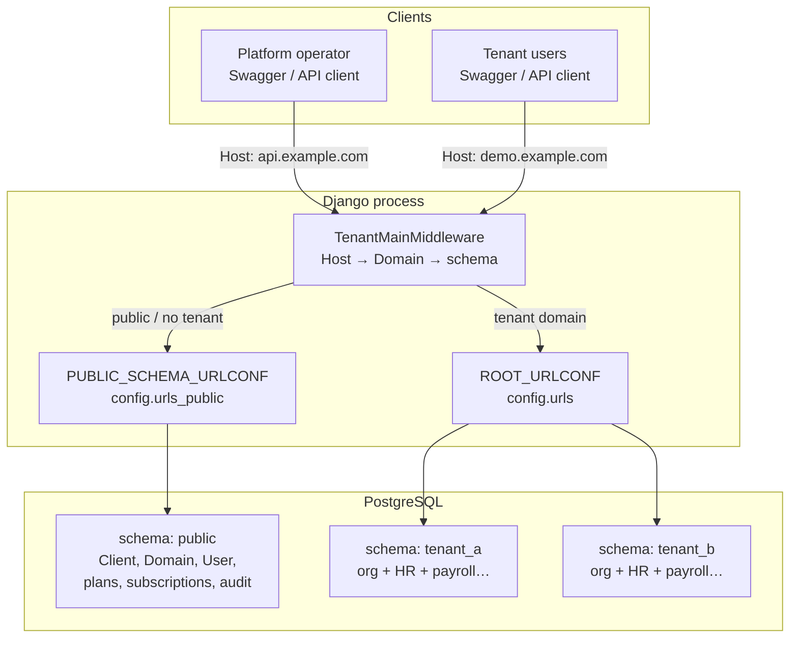
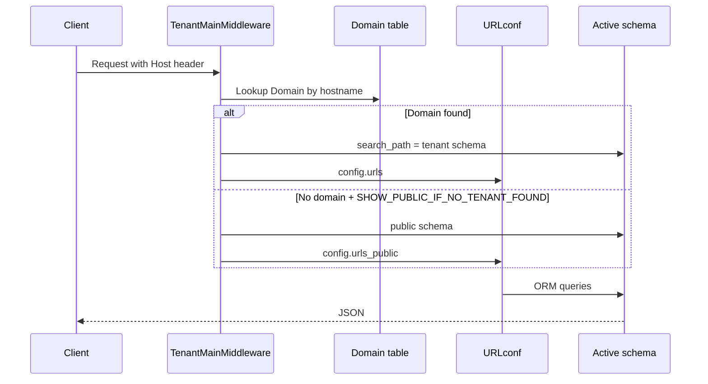
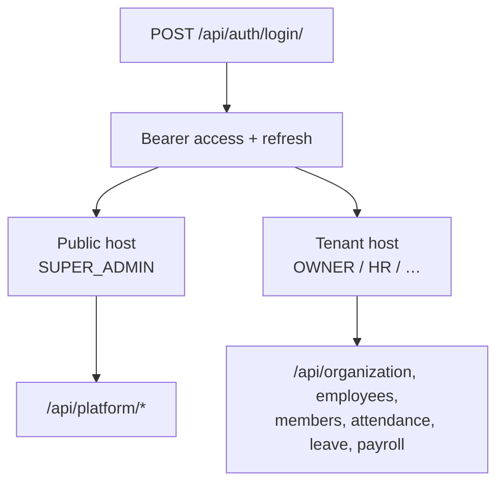
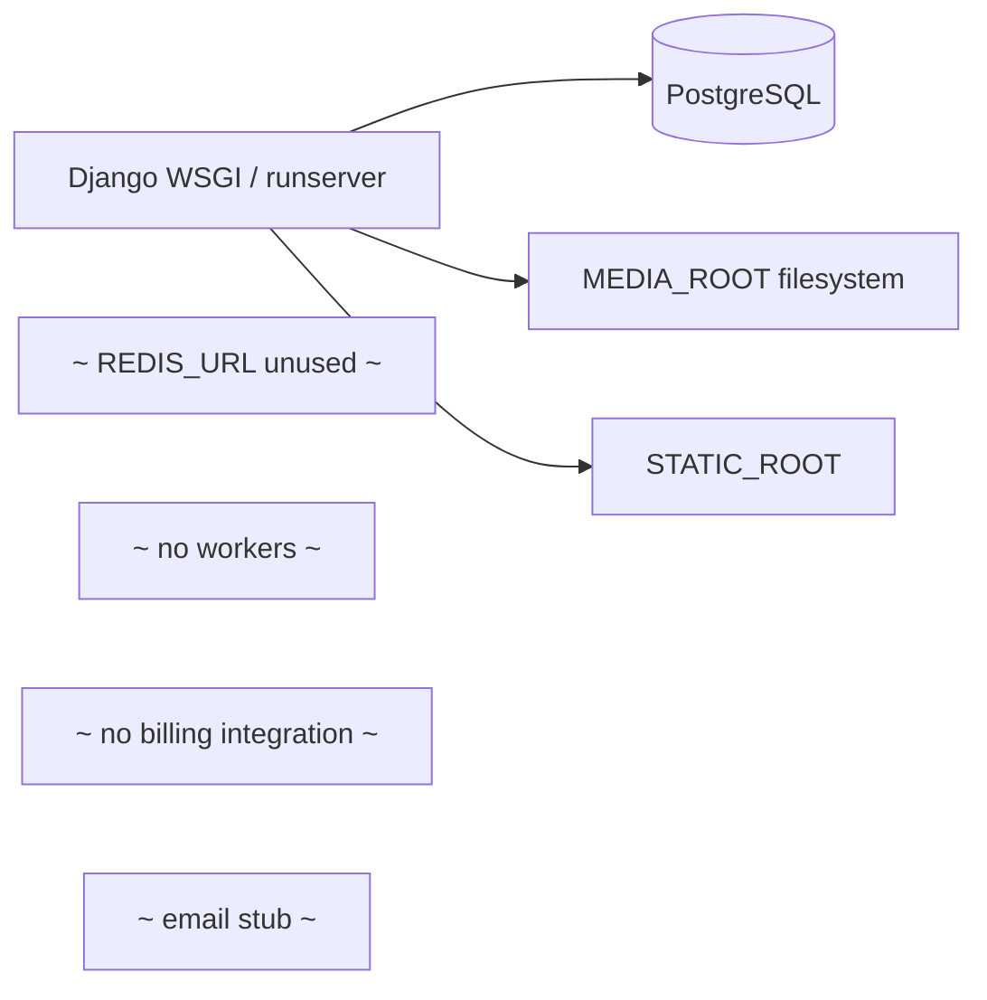

# Office SaaS — Architecture & Project Documentation

**Product name (settings):** Saas HRM  
**Type:** Multi-tenant HR / cooperative **API** (Django + DRF)  
**Tenancy:** PostgreSQL schema-per-tenant via `django-tenants`  
**Frontend:** None in this repository (OpenAPI / Swagger only)

This document describes the system **as implemented today**.

---

## 1. Overview

Office SaaS is a backend platform where:

1. A **platform operator** manages plans, provisions tenants, and audits actions on the **public** schema.
2. Each **tenant** (customer organization) gets an isolated PostgreSQL **schema** with its own organization, employees, members, attendance, leave, and payroll data.
3. Routing is **hostname-based**: the HTTP `Host` header selects the tenant (or public platform).

| Concern | Choice |
|---------|--------|
| Language | Python 3.12 |
| Framework | Django 6.0.7 |
| Multi-tenancy | django-tenants 3.x |
| API | Django REST Framework + SimpleJWT |
| Docs | drf-spectacular (Swagger / ReDoc) |
| Database | PostgreSQL only (`django_tenants.postgresql_backend`) |
| Async workers | Not used (no Celery / Redis / Channels) |
| Payments | Plans stored only; no Stripe |
| Email | Stub (prints; no SMTP wiring) |

---

## 2. Repository structure

```
office-saas/
├── README.MD                 # Local migrate + tenant shell recipes
├── render.yaml               # Render Blueprint (no Docker)
├── docker-compose.yml        # Optional local Postgres + runserver
├── docs/
│   ├── ARCHITECTURE.md       # This file
│   └── RENDER_DEPLOY.md      # Free-plan test deploy runbook
└── backend/
    ├── manage.py             # DJANGO_SETTINGS_MODULE=config.settings.local
    ├── build.sh / start.sh   # Render build & start (gunicorn)
    ├── runtime.txt           # Python 3.12.8
    ├── requirements/base.txt
    ├── config/
    │   ├── settings/
    │   │   ├── base.py       # Shared settings + DATABASE_URL
    │   │   ├── local.py      # Local Postgres overrides
    │   │   └── production.py # Render / PaaS settings + WhiteNoise
    │   ├── urls.py           # Tenant URLconf
    │   ├── urls_public.py    # Platform (public) URLconf
    │   ├── wsgi.py / asgi.py # Default: production settings
    └── apps/
        ├── tenants           # Client, Domain
        ├── accounts          # Shared User + JWT auth
        ├── saas_manager      # Platform: plans, provision, audit
        ├── common
        ├── organizations
        ├── employees
        ├── members
        ├── attendance
        ├── leave
        └── payroll
```

**Placeholder / empty app dirs (no real code yet):** `audit`, `cooperative`, `hr`, `notifications`.

---

## 3. High-level architecture



### Shared vs tenant apps

Configured in `backend/config/settings/base.py`:

| Layer | Apps |
|-------|------|
| **SHARED_APPS** (public schema) | `django_tenants`, `apps.tenants`, `apps.accounts`, Django contrib, DRF, JWT, CORS, spectacular, `apps.saas_manager` |
| **TENANT_APPS** (per-tenant schema) | `apps.common`, `apps.organizations`, `apps.employees`, `apps.members`, `apps.attendance`, `apps.leave`, `apps.payroll` |

- `TENANT_MODEL` = `tenants.Client`
- `TENANT_DOMAIN_MODEL` = `tenants.Domain`
- `SHOW_PUBLIC_IF_NO_TENANT_FOUND = True`

---

## 4. Request routing flow



### Local examples

| Host | Schema | API surface |
|------|--------|-------------|
| `localhost:8000` | public | Auth + `/api/platform/*` |
| `demo.localhost:8000` | `demo` | Auth + org / HR / payroll |

Windows tip: `*.localhost` usually resolves to `127.0.0.1` without hosts-file edits.

---

## 5. Multi-tenancy model

### Models (`apps.tenants`)

```text
Client (TenantMixin)
  - name, schema_name, paid_until, on_trial, created_on
  - auto_create_schema = True

Domain (DomainMixin)
  - domain (hostname), tenant FK, is_primary
```

Saving a `Client` creates the PostgreSQL schema and syncs tenant apps when `auto_create_schema` is true.

### Users (`apps.accounts`)

Users live in the **public** schema:

- Email-based custom user (`AUTH_USER_MODEL = accounts.User`)
- Optional FK `tenant → Client`
- Roles: `SUPER_ADMIN`, `OWNER`, `HR`, `MANAGER`, `ACCOUNTANT`, `EMPLOYEE`
- JWT: access 15m, refresh 7d, rotate + blacklist

Platform admins typically have `tenant=null` and `role=SUPER_ADMIN`. Tenant users must match `request.tenant`.

---

## 6. Tenant provisioning lifecycle

```mermaid
flowchart LR
  A[Platform JWT] --> B[POST /api/platform/tenants/create_tenant/]
  B --> C[Client + Domain]
  C --> D[TenantSubscription TRIAL]
  D --> E[migrate_schemas]
  E --> F[Seed defaults]
  F --> G[support@example.com OWNER]
  G --> H[Welcome email stub]
  H --> I[AuditEvent]

  J[Shell / Django admin] -.-> C
```

### Seeded defaults (per tenant)

From `TenantProvisioningService._seed_tenant_data`:

- Organization (tenant name), timezone `Asia/Kathmandu`, currency `NPR`
- Branch: Head Office (`HO`)
- Departments: HR, Finance, IT, Administration, Operations
- Leave types: Annual, Casual, Sick, Public Holiday
- Default shift 09:00–17:00
- Weekend policy: Saturday off
- Company settings

### Manual creation (reliable for demos)

See root `README.MD` shell recipe: create `Client` + `Domain`, then create a `User` with `tenant=` set.

> Provisioning via API still has rough edges (stub email, incomplete imports/templates in places). Prefer shell for first demos if the API path fails.

---

## 7. Authentication flow



Auth endpoints (both URL confs):

| Method | Path | Purpose |
|--------|------|---------|
| POST | `/api/auth/login/` | Obtain tokens |
| POST | `/api/auth/refresh/` | Refresh access |
| POST | `/api/auth/logout/` | Blacklist refresh |
| GET | `/api/auth/me/` | Current user |
| POST | `/api/auth/change-password/` | Change password |

---

## 8. Domain modules

### Platform (`saas_manager`) — public schema

| Resource | Path prefix | Notes |
|----------|-------------|-------|
| Plans | `/api/platform/plans/` | Limits + feature JSON |
| Subscriptions | `/api/platform/subscriptions/` | Trial / active / suspended |
| Tenants | `/api/platform/tenants/` | CRUD + `create_tenant`, `suspend`, `activate`, `reset_password` |
| Audit | `/api/platform/audit-events/` | Operator actions |
| Announcements | `/api/platform/announcements/` | System messages |
| Dashboard | `/api/platform/dashboard/` | Platform metrics |

### Tenant apps

| App | API prefixes | Responsibility |
|-----|--------------|----------------|
| **organizations** | `organization`, `branches`, `departments`, `designations`, `fiscal-years`, `holidays`, `settings` | Org structure & company prefs |
| **employees** | `employees` | Employees + nested profile/docs |
| **members** | `members` | Cooperative members / KYC |
| **attendance** | `shifts`, `employee-shifts`, `attendance`, `attendance-logs`, `weekend-policies` | Time tracking |
| **leave** | `leave-types`, `leave-requests`, `leave-approvals` | Leave workflow |
| **payroll** | `salary-components`, `salary-structures`, `employee-salaries`, `payroll`, `bonuses`, `loans`, `advance-salaries`, `tax-slabs` | Compensation & runs |

Also on tenant host: `/tenant-info/`, `/api/docs/`.

---

## 9. Infrastructure & dependencies



### What exists today

- `docker-compose.yml`: Postgres 15 + `manage.py runserver`
- Local media under `backend/media/` (FileField / ImageField uploads)
- Static via Django `STATIC_ROOT` (no WhiteNoise configured yet)

### What does **not** exist yet

- Celery / Redis usage
- Django Channels / WebSockets
- Stripe or payment gateway
- Real SMTP / transactional email
- Object storage (S3) for media
- Celery / Redis / Channels (still unused)

### Dependency gap

`backend/requirements/base.txt` is incomplete relative to imports in code / local venv. For Docker or Render you must also pin at least:

- `django-tenants`
- `django-cors-headers`
- `djangorestframework-simplejwt`
- `gunicorn`
- `Pillow` (and typically `reportlab` for payslips)

---

## 10. Settings modules

| Module | Role |
|--------|------|
| `base.py` | SHARED/TENANT apps, middleware, JWT, spectacular, `DATABASE_URL` via `dj-database-url` |
| `local.py` | Hardcoded local Postgres; `DEBUG=True`; `ALLOWED_HOSTS=['*']` |
| `production.py` | Render-ready (`DATABASE_URL`, WhiteNoise, secure cookies) |

Important env vars (base):

| Variable | Used |
|----------|------|
| `SECRET_KEY` | Yes |
| `DEBUG` | Yes (`== 'True'`) |
| `DATABASE_URL` | Yes in `base` (overridden by `local.py`) |
| `ALLOWED_HOSTS` | When `DEBUG` is false |
| `REDIS_URL` | Present in `.env` only — unused |

`manage.py` defaults to `config.settings.local`.  
`wsgi.py` defaults to `config.settings` (broken until production package is wired).

---

## 11. Local development bootstrap

From project root / `backend` (see also `README.MD`):

```bash
# 1. Create Postgres DB (e.g. office_saas)

# 2. Migrations
python manage.py makemigrations tenants accounts saas_manager
python manage.py makemigrations organizations employees members attendance leave payroll
python manage.py migrate_schemas --shared
python manage.py migrate_schemas

# 3. Platform superuser (public schema)
python manage.py shell
# User.objects.create_superuser(...)

# 4. Tenant + domain
# Client(schema_name='demo', name='Demo Tenant').save()
# Domain(domain='demo.localhost', tenant=..., is_primary=True).save()

# 5. Tenant user with tenant= Client instance
```

> `.gitignore` ignores `**/migrations/*` except `__init__.py`. For any shared or cloud deploy, **commit real migration files** or every environment must run `makemigrations` first (fragile).

---

## 12. OpenAPI documentation

| Host | Swagger | Schema |
|------|---------|--------|
| Public | `/api/docs/` | `/api/schema/` using `urls_public` metadata |
| Tenant | `/api/docs/` | `/api/schema/` using `urls` metadata |

Titles distinguish **Platform API** vs **Tenant API**.

---

## 13. Security & production readiness (current gaps)

| Item | Status |
|------|--------|
| Schema isolation | Designed correctly for Postgres |
| Host-based tenant resolution | Implemented |
| CORS open to all | Dev-only; tighten for prod |
| `DEBUG` / `ALLOWED_HOSTS` | Must be strict in production |
| Secrets in `local.py` | Local only; never ship passwords |
| Media on ephemeral disk | Lost on PaaS free tiers |
| Migrations | Committed (`0001_initial` per app) |
| Production settings | Present (`production.py` + `render.yaml`) |
| Email / billing | Not production-grade |

---

## 14. Maturity snapshot

| Area | Status |
|------|--------|
| Multi-tenant core | Solid foundation |
| Platform control plane | Present |
| Org / employees / members | Substantial |
| Attendance / leave / payroll | Substantial domain services |
| API docs | Host-aware Spectacular |
| Frontend | None |
| Deploy packaging | Render-ready (native Python, no Docker) — see [RENDER_DEPLOY.md](./RENDER_DEPLOY.md) |
| Free Render demo | Feasible for short tests — see [RENDER_DEPLOY.md](./RENDER_DEPLOY.md) |

---

## 15. Related docs

- [RENDER_DEPLOY.md](./RENDER_DEPLOY.md) — Render free-plan test hosting, env vars, two-tenant setup
- Root [README.MD](../README.MD) — migrate and shell recipes
