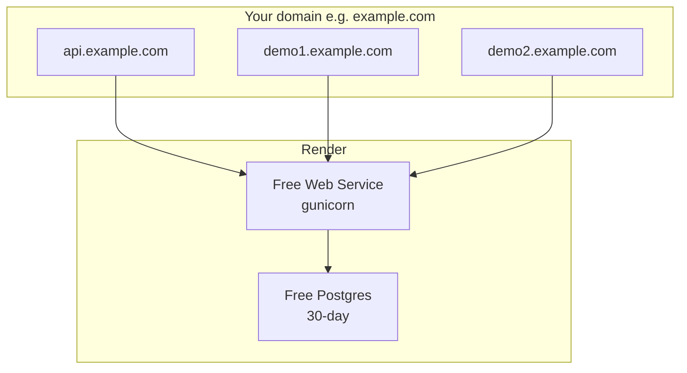

# Render free-plan deploy runbook (test / demo)

This guide covers hosting the **Office SaaS API** on [Render](https://render.com) **free** resources long enough to test the project and create **one or two tenants**.

**Deploy style:** native **Python web service** + **Render Postgres**. No Docker, no Redis, no Celery.

It is **not** a production checklist. Free Postgres expires after ~30 days; free web services sleep after idle time.

For architecture context, see [ARCHITECTURE.md](./ARCHITECTURE.md).

---

## 1. Feasibility summary

| Question | Answer |
|----------|--------|
| Can we test on Render free? | **Yes** — packaging for this is in the repo |
| Create 1–2 tenants? | **Yes** (schemas are cheap; hostnames are the constraint) |
| Always-on production? | **No** — cold starts, 30-day DB, no persistent media disk |
| Need Redis / Celery / Docker? | **No** |

### Render free limits (relevant)

| Resource | Typical free limit | Impact |
|----------|-------------------|--------|
| Web service | ~512 MB RAM, sleeps ~15 min idle, cold start 30–60s | Slow first request; migrate during provision may be tight on RAM |
| Postgres | ~1 GB storage, **expires ~30 days**, one free DB per workspace | Fine for a short demo |
| Persistent disk | **Not** on free web | Uploaded media lost on restart/redeploy |
| Custom domains | Supported | **Required** for two clean tenant hostnames |

---

## 2. What the repo already includes for Render

| File / area | Purpose |
|-------------|---------|
| `backend/config/settings/production.py` | `DEBUG=False`, `DATABASE_URL`, WhiteNoise, CORS/CSRF, SSL proxy headers |
| `backend/config/wsgi.py` | Defaults to `config.settings.production` |
| `backend/requirements/base.txt` | Django, tenants, JWT, CORS, gunicorn, WhiteNoise, Pillow, reportlab |
| `backend/build.sh` | `pip install` + `collectstatic` |
| `backend/start.sh` | `migrate_schemas` + gunicorn on `$PORT` |
| `backend/runtime.txt` | Python 3.12.8 |
| `render.yaml` | Blueprint: free web + free Postgres |
| App `migrations/0001_initial.py` | Committed so deploy can migrate without `makemigrations` |

Local development still uses `manage.py` → `config.settings.local`.

---

## 3. Recommended Render topology (test)



| Hostname | Role | `Domain` / Host usage |
|----------|------|------------------------|
| `api.example.com` **or** `office-saas-api.onrender.com` | Platform (public) | No tenant Domain row (public fallback) |
| `demo1.example.com` | Tenant 1 | `Domain.domain = 'demo1.example.com'` |
| `demo2.example.com` | Tenant 2 | `Domain.domain = 'demo2.example.com'` |

All DNS records point at the **same** Render web service.

### Without a custom domain

You only get one free hostname like `office-saas-api.onrender.com`. That supports **platform testing** and **at most one** tenant (register that exact host as the tenant `Domain`). Two tenants need two distinct Host values → custom domain.

Production settings allow `*.onrender.com` automatically when `RENDER=true` and `ALLOWED_HOSTS` is unset.

---

## 4. Deploy on Render (no Docker)

### Option A — Blueprint (recommended)

1. Push this repo to GitHub/GitLab.
2. Render Dashboard → **New** → **Blueprint**.
3. Select the repo (uses root `render.yaml`).
4. Apply the Blueprint (creates **office-saas-db** + **office-saas-api**).
5. In the web service **Environment**, optionally set:
   - `ALLOWED_HOSTS` = `office-saas-api.onrender.com,demo1.example.com,demo2.example.com` (your real hosts)
   - `CSRF_TRUSTED_ORIGINS` = `https://office-saas-api.onrender.com,...` if you use session/admin

### Option B — Manual services

#### 4.1 PostgreSQL

1. **New** → **PostgreSQL** → plan **Free**
2. Copy the **Internal Database URL**

#### 4.2 Web service

1. **New** → **Web Service** → connect the repo  
2. Runtime: **Python 3**  
3. **Root Directory:** `backend`  
4. Instance: **Free**  
5. **Build Command:**

   ```bash
   chmod +x build.sh && ./build.sh
   ```

6. **Start Command:**

   ```bash
   chmod +x start.sh && ./start.sh
   ```

7. **Environment:**

| Key | Value |
|-----|--------|
| `DJANGO_SETTINGS_MODULE` | `config.settings.production` |
| `PYTHON_VERSION` | `3.12.8` |
| `SECRET_KEY` | Generate (Render “Generate” button) |
| `DEBUG` | `False` |
| `DATABASE_URL` | From Postgres (Internal URL) |
| `DATABASE_SSL_REQUIRE` | `True` |
| `SECURE_SSL_REDIRECT` | `False` (Render terminates TLS; keeps health checks working) |
| `CORS_ALLOW_ALL_ORIGINS` | `True` for throwaway Swagger demos |
| `ALLOWED_HOSTS` | Optional; defaults to `.onrender.com` on Render |

### 4.3 Custom domains (for two tenants)

Web service → **Settings** → **Custom Domains**:

1. Add `api.example.com`, `demo1.example.com`, `demo2.example.com`
2. Create the DNS records Render shows
3. Wait for TLS
4. Update `ALLOWED_HOSTS` to include every hostname

---

## 5. Post-deploy bootstrap (platform + two tenants)

Use Render **Shell** on the web service.

### 5.1 Platform superuser

```bash
python manage.py shell
```

```python
from apps.accounts.models import User

User.objects.create_superuser(
    email='admin@example.com',
    password='CHANGE_ME',
    first_name='Platform',
    last_name='Admin',
)
```

### 5.2 Create a plan (required for API provisioning)

```python
from apps.saas_manager.models import TenantPlan

TenantPlan.objects.create(
    name='Starter',
    code='STARTER',
    monthly_price=0,
    yearly_price=0,
    max_users=50,
    max_storage_mb=500,
    max_api_calls=100000,
    features={'attendance': True, 'payroll': True, 'leave': True},
    is_active=True,
)
```

### 5.3 Create two tenants (shell — recommended for first demo)

```python
from apps.tenants.models import Client, Domain
from apps.accounts.models import User

def make_tenant(schema, name, host, owner_email, owner_password):
    tenant = Client(schema_name=schema, name=name, on_trial=True)
    tenant.save()  # creates schema when auto_create_schema=True
    Domain.objects.create(domain=host, tenant=tenant, is_primary=True)
    User.objects.create_user(
        email=owner_email,
        password=owner_password,
        first_name='Owner',
        last_name=name,
        role=User.Role.OWNER,
        tenant=tenant,
    )
    return tenant

# Custom domains:
make_tenant('demo1', 'Demo One', 'demo1.example.com', 'owner1@demo.com', 'CHANGE_ME')
make_tenant('demo2', 'Demo Two', 'demo2.example.com', 'owner2@demo.com', 'CHANGE_ME')

# Or single-tenant on free onrender host only:
# make_tenant('demo1', 'Demo One', 'office-saas-api.onrender.com', 'owner1@demo.com', 'CHANGE_ME')
```

If schema exists but tenant apps are empty:

```bash
python manage.py migrate_schemas --schema_name=demo1
python manage.py migrate_schemas --schema_name=demo2
```

### 5.4 Optional: provision via platform API

1. Login on the **public** host:

   `POST https://office-saas-api.onrender.com/api/auth/login/`

2. Create tenants:

   `POST https://office-saas-api.onrender.com/api/platform/tenants/create_tenant/`

   ```json
   {
     "name": "Demo One",
     "schema_name": "demo1",
     "domain": "demo1.example.com",
     "plan_id": 1
   }
   ```

If this fails, use the shell method in §5.3.

---

## 6. Verification checklist

| Step | URL / action | Expect |
|------|----------------|--------|
| Platform docs | `https://<service>.onrender.com/api/docs/` | Platform OpenAPI |
| Platform login | `POST /api/auth/login/` with admin | Tokens |
| Tenant 1 docs | `https://demo1.example.com/api/docs/` | Tenant OpenAPI |
| Tenant 1 login | owner1 credentials | Tokens; `/api/auth/me/` shows tenant |
| Tenant 2 isolation | Create employee on demo1; list on demo2 | Not visible |
| Tenant info | `GET https://demo1.example.com/tenant-info/` | Tenant metadata |

Cold start: first request after ~15 minutes idle may take 30–60 seconds.

---

## 7. Media & static files on free tier

| Asset | Behavior | Notes |
|-------|----------|--------|
| Static (admin, Spectacular) | WhiteNoise + `collectstatic` in `build.sh` | Covered |
| Media uploads | Ephemeral disk | Avoid file uploads in demos, or add S3 later |

---

## 8. Cost / lifecycle notes

- Free Postgres: upgrade or export before day 30 or data is deleted after grace period.
- Free web hours: sleeping after idle is expected.
- Do not put real PII or production payroll on free Render.

---

## 9. Deploy checklist

- [ ] Repo pushed (includes migrations + `render.yaml`)
- [ ] Blueprint or manual web + Postgres created
- [ ] Service healthy (`/api/docs/` opens)
- [ ] Platform admin created
- [ ] 1–2 tenants + Domain hostnames created
- [ ] Custom domains (if testing two tenants)
- [ ] Swagger login works on public and tenant hosts

---

## 10. After the free trial

1. Upgrade Postgres (paid) or move DB  
2. Paid web instance (no sleep) if you need always-on  
3. Persistent disk or S3 for media  
4. Real email, restricted CORS (`CORS_ALLOW_ALL_ORIGINS=False`)  
5. Set explicit `ALLOWED_HOSTS` / `CSRF_TRUSTED_ORIGINS`

---

## Related

- [ARCHITECTURE.md](./ARCHITECTURE.md)
- Root [README.MD](../README.MD)
- Blueprint: [`render.yaml`](../render.yaml)
- Scripts: [`backend/build.sh`](../backend/build.sh), [`backend/start.sh`](../backend/start.sh)
